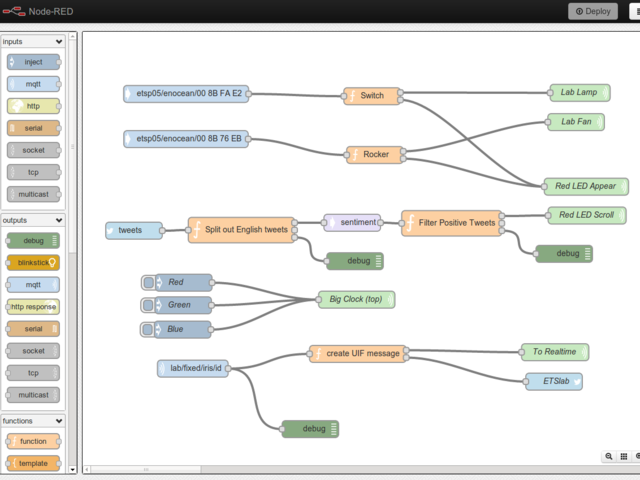
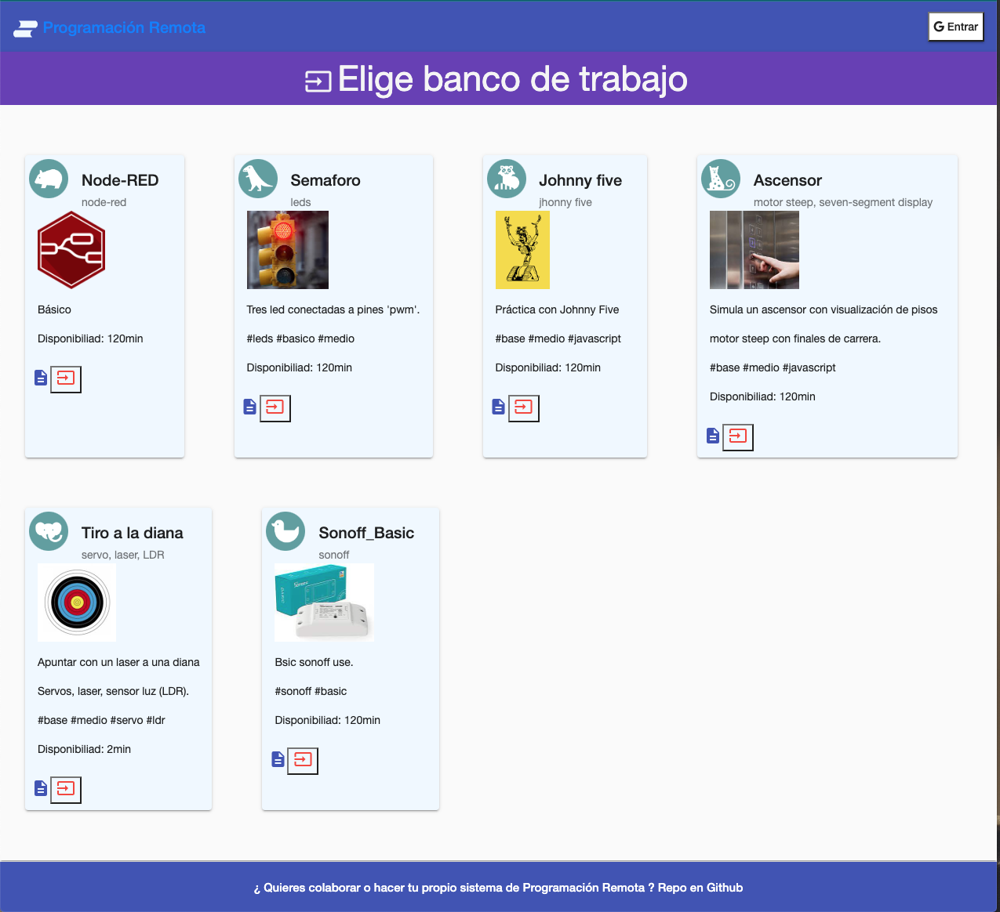
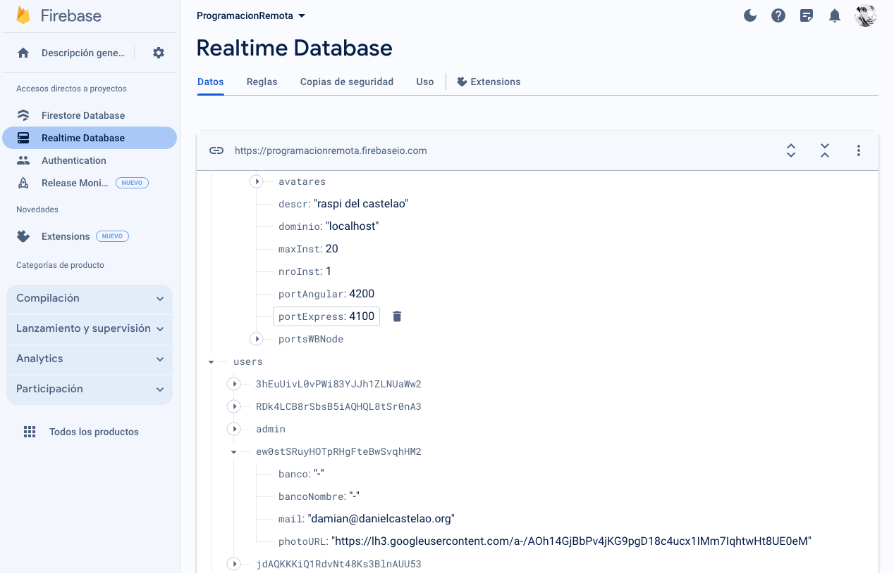

# Programacion Remota

---

Este proyecto surge de la necesidad de programar microcontroladores a distancia, sin la necesidad de tener que estar físicamente en el lugar donde se encuentran los microcontroladores.

## Tecnologías

### Servidor

Los microcontroladores están conectados por USB o por MQTT a un servidor (por ejemplo una Rasperry Pi).

En este servidor está instalado Node-RED, que es un entorno de programación visual para IoT.

Node-RED permite programar los microcontroladores a través de un flujo de datos.

Cada usuario tendrá la posibilidad de acceder a un flujo de datos para programar sus microcontroladores.

Cada vez que un usuario se loguea en la plataforma, se la asigna una instancia de Node-RED.

Esta gestión la hace el servidor.

#### Herramientas
- [Node-RED](https://nodered.org/)
- [MQTT](https://mqtt.org/)
- [Node.js](https://nodejs.org/)
- [Express](https://expressjs.com/)
- [Python](https://www.python.org/)
- [PM2](https://pm2.keymetrics.io/)

### Cliente

El cliente es una plataforma web que permite a los usuarios acceder a los controladores.

La autenticación es con cuenta de Google y mediante Firebase.

En todo momento el usuario sabe cuáles son los microcontroladores que tiene disponibles y cuáles están siendo utilizados por otros usuarios.

Una vez que el usuario selecciona un microcontrolador, se le abre una _sala_, con instancia de Node-RED para que pueda programar su microcontrolador.

En esta _sala_ además de poder usar el Node-RED, también hay una ventana de visualización en tiempo real del microcontrolador y los sensores conectados a él.

Esta visualización se hace con una cámara conectada al servidor. Hay una cámara por cada microcontrolador

#### Herramientas

- [Angular](https://angular.io/)
- [Firebase](https://firebase.google.com/)
- [ESP32-Cam](https://randomnerdtutorials.com/esp32-cam-video-streaming-face-recognition-arduino-ide/)

### Base de Datos

Todo el flujo de datos de la aplicación se registra en una base de datos.

Se utiliza [Firebase - Realtime](https://firebase.google.com/docs/database?hl=es-419) para el registro de usuarios y para el registro de los microcontroladores.

Desde esta Base de Datos se obtiene la información del estado de los usuarios en tiempo real.

---

Documentación técnica en la [wiki](https://github.com/damiannogueiras/ProgramacionRemota/wiki)
